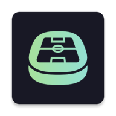

# OpenBl
Android App showcasing the 1./2./3.Bundesliga (german soccer leagues) tables and results.    
Therefore it uses the [OpenLigaDb Api](https://github.com/OpenLigaDB/OpenLigaDB-Samples).

## Screenshots

## License
OpenBL is licensed under the GPL-3.0 or later.
