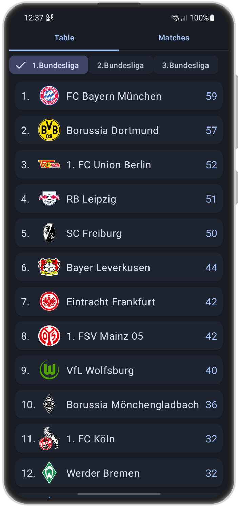
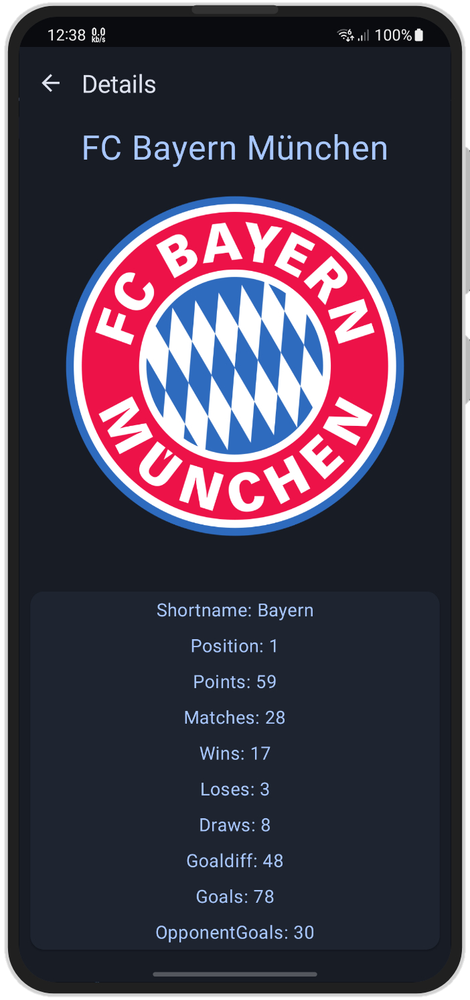
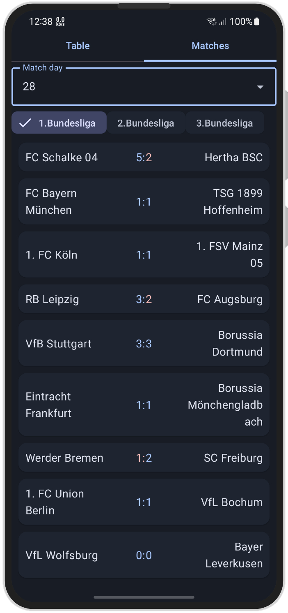

	

# OpenBl

Android app that provides you with up-to-date information on the top three soccer leagues in Germany using the [OpenLigaDb API](https://github.com/OpenLigaDB/OpenLigaDB-Samples).

## Screenshots

## License
OpenBL is licensed under the GPL-3.0 or later.
